# Splunk 1: Protecting VSI (Baselines, Alerts, Dashboards, and Queries)
## Scenario

Virtual Space Industries (VSI) is a company which designs virtual reality programs for business. VSI has heard rumors that a competitor, JobeCorp, may be launching cyberattacks to disrupt VSI's business.

As SOC analysts, you are tasked with using Splunk to monitor potential attacks on your systems and applications. Your Networking team has provided you with past logs to help you develop baselines and create reports, alerts, and dashboards.

**You've been provided the following logs:**

**Windows Server Logs:** This server contains intellectual property of VSI's next-generation virtual reality programs.

**Apache Server Logs:** This server is used for VSI's main public-facing website vsi-company.com.

***

# Windows Server Logs

>## Reports:

A report with a table of signatures and associated SignatureID.

`source="windows_server_logs.csv" | table signature signature_id signature | dedup signature_id signature`

A report that provides the count and percent of the severity.

`source="windows_server_logs.csv" | top severity`

A report that provides a comparison between the success and failure of Windows activities.

`source="windows_server_logs.csv" | top status`

 
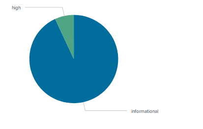 
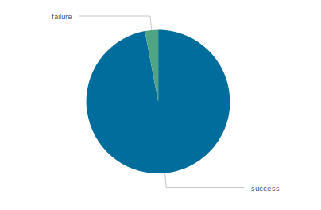

---

>## Alerts: 

### Failed Windows activity Alert
`source="windows_server_logs.csv" status=failure`

**Range 4 - 20
Baseline 12 
Threshold 25**

---

### Successfully logged on account alert
`source="windows_server_logs.csv" signature="An account was successfully logged on"`

**Range 16 - 42
Baseline 29
Threshold 35**
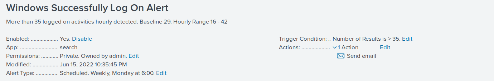

---

### User account deleted alert
`source="windows_server_logs.csv" signature_id=4726`

**Range 14 - 44
Baseline 29 
Threshold 35**
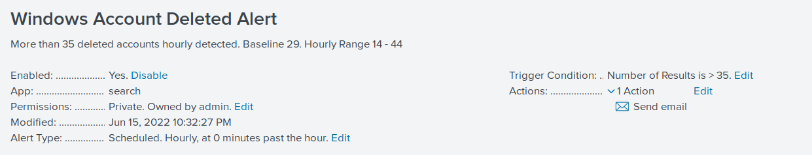

---

>## Visualizations and Dashboards:
- A line chart that displays the different signature field values over time.

	`source="windows_server_logs.csv" | timechart span=1h count by signature`

---

- A line chart that displays the different user field values over time.

	`source="windows_server_logs.csv" | timechart span=1h count by user`

---

- A bar, column, or pie chart that illustrates the count of different signatures.

	`source="windows_server_logs.csv" | stats count by signature`

---

- A bar, column, or pie chart that illustrates the count of different users.

	`source="windows_server_logs.csv" | stats count by user`

---
- A statistical chart that illustrates the count of different users.

	`source="windows_server_logs.csv" | stats count by user`

---
- radial gauge

	`source="windows_server_logs.csv" signature="System security access was removed from an account" | stats count`

---
- Bar Chart to count reset account password

	`source="windows_server_logs.csv" signature="An attempt was made to reset an accounts password" | stats count by user`

---

- Table of percentage of signatures compare to the total number of signatures

	`source="windows_server_logs.csv" | stats count by signature | eventstats sum(count) as total | eval % = round(count/total*100) | fields - total`

---

- Adding features to the Dashboard:  adding the ability to change the time range for all visualizations.

---

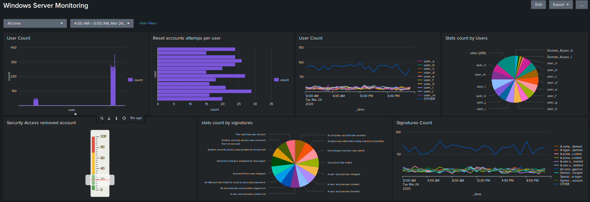
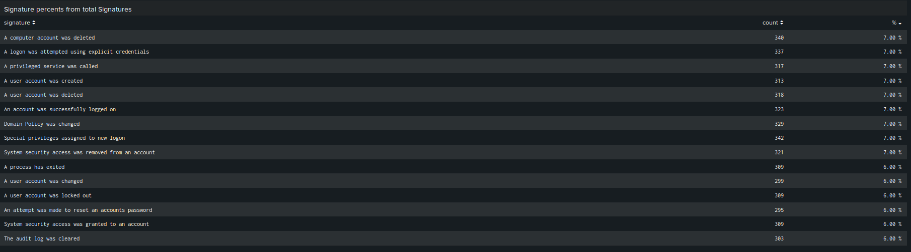

 
***

# Apache Web Server

>## Reports:

A report that shows a table of the different HTTP methods (GET, POST, HEAD, etc).

`source="apache_logs.txt" | top limit=20 method`

A report that shows the top 10 domains that referred to VSI's website.

`source="apache_logs.txt" | top limit=10 referer_domain`

A report that shows the count of the HTTP response codes.

`source="apache_logs.txt" |  top status`

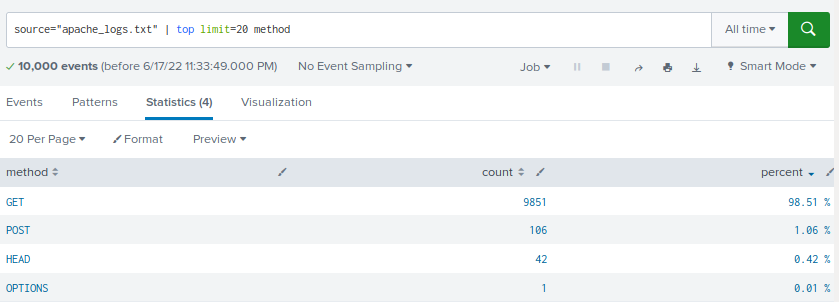 
 
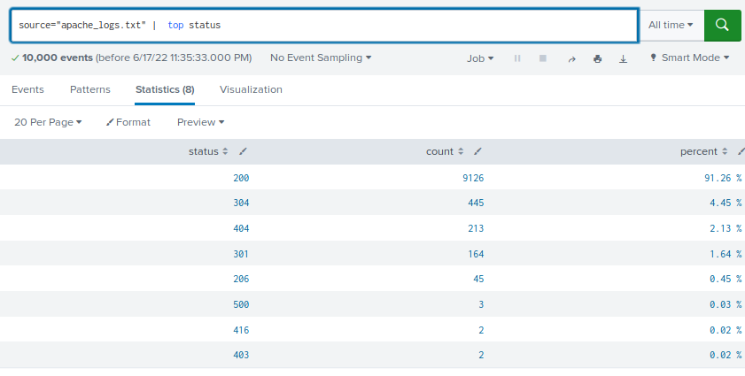

---

>## Alerts:

### International Activity Alert

`source="apache_logs.txt" | iplocation clientip | where Country!="United States"`

Range 1 - 120
Baseline 62 
Threshold 170
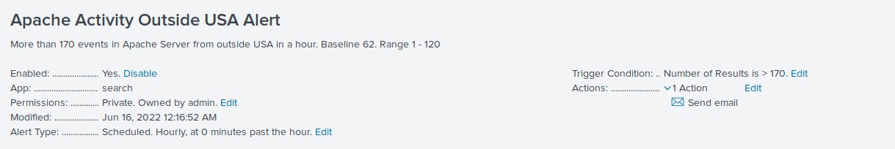

---

### HTTP POST Method Alert

`source=”apache_logs.txt” method=POST`

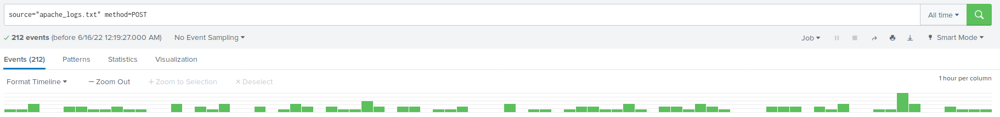
Range 2 -14
Baseline 8 
Threshold 20
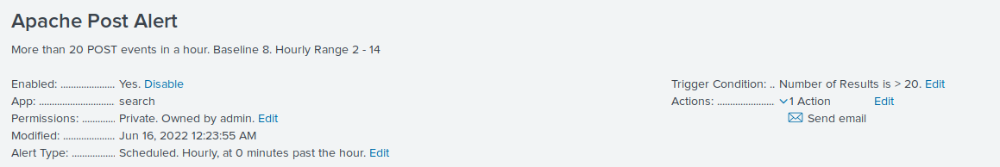

---

>## Visualizations and Dashboards:

- A line chart that displays the different HTTP methods field over time.

	`source="apache_logs.txt" | timechart span=1h count by method`

---

- A geographical map showing the location based on the clientip field.

	`source="apache_logs.txt" | iplocation clientip | geostats count`

---

- A bar, column, or pie chart that displays the number of different URIs.

	`source="apache_logs.txt" | top limit=10 uri`

- A bar, column, or pie chart that displays the counts of the top 10 countries.

	`source="apache_logs.txt" | iplocation clientip | top limit=10 Country`

---

- A statistical chart that illustrates the count of different user agents.

	`source="apache_logs.txt" | top limit=10 useragent`

---

- radial gauge

	`source="apache_logs.txt" status=404 | stats count as total`

---

- Adding features to the Dashboard:  adding the ability to change the time range for all visualizations.

---

