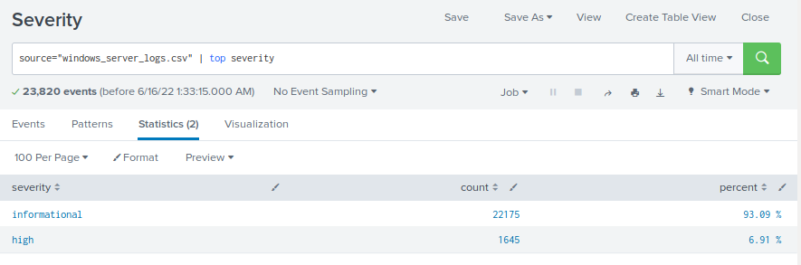
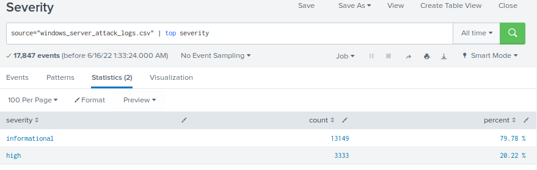
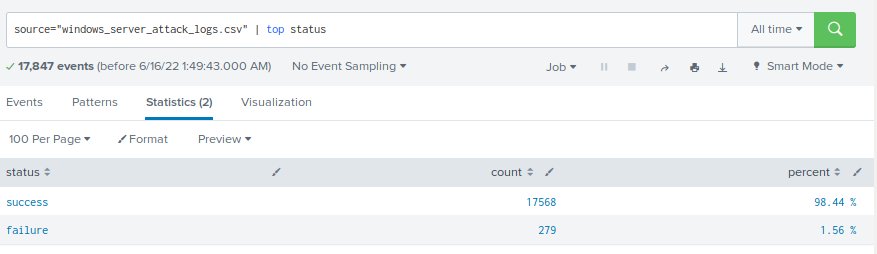
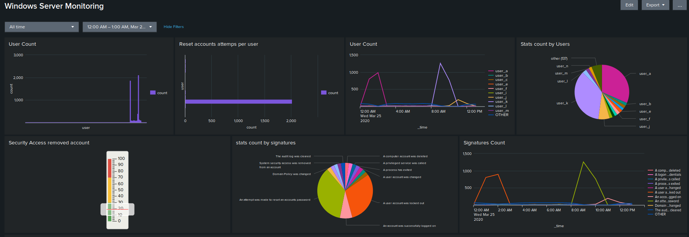
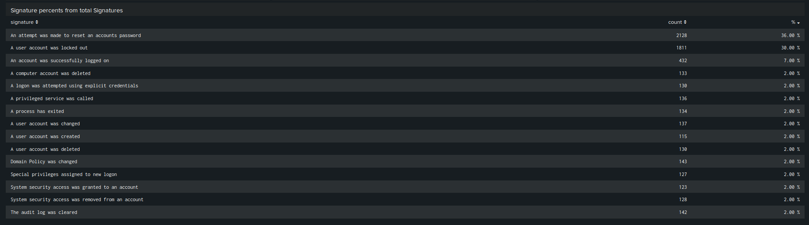
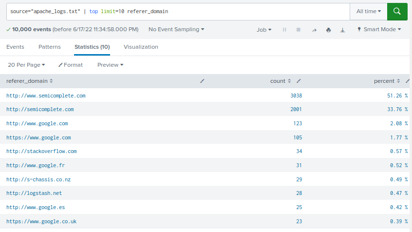
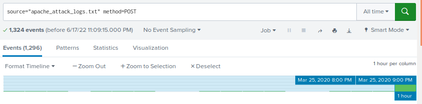
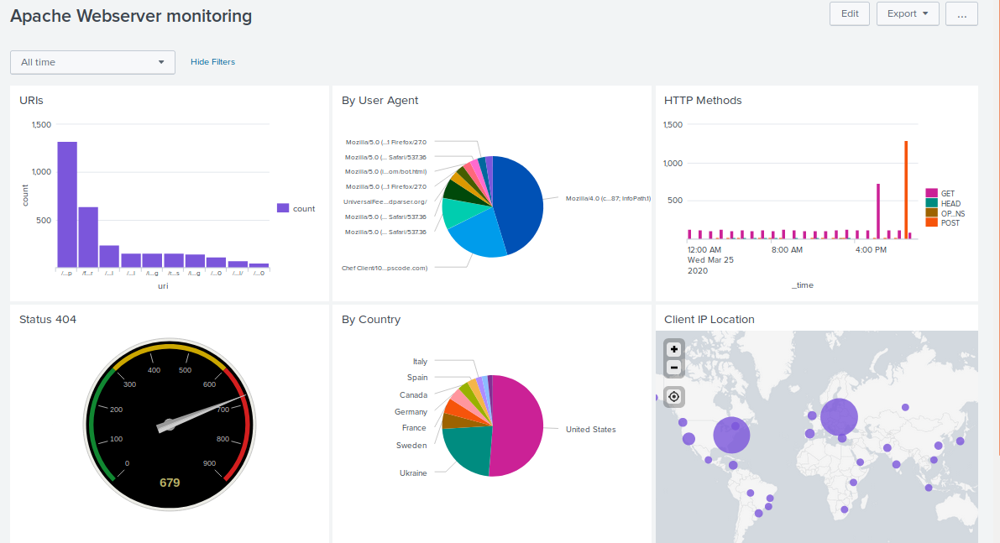

# Splunk 2: Defend Your SOC (Attack Detection)
## Scenario

VSI recently experienced several cyberattacks, likely from their adversary JobeCorp. Fortunately, your SOC team had set up several monitoring solutions to help VSI quickly identify what was attacked. These monitoring solutions will also help VSI create mitigation strategies to protect the organization.

Sample File: [windows_server_attack_logs.csv](<Resources/windows_server_attack_logs.csv> "Windows Server Attack Logs File")

Sample File: [apache_attack_logs.txt](<Resources/apache_attack_logs.txt> "Apache Attack Logs File")

***

# Windows Server Logs

>## Reports:

### Report Analysis for Severity

Before the Attack

Current

### Observations:

The high severity increase more than double

---

### Report Analysis for Failed Activities

Before the Attack

Current

### Observations:

The failure activities decreased

---

>## Alerts:

### Alert Analysis for Failed Windows Activity

### Observations:

The alert triggers on Wednesday 25 March. 2020 at 8 AM as the threshold of 25 events is triggered. 35 events were detected during that hour. The alert was triggered only at that hour, so no changes are required.

---

### Alert Analysis for Successful Logged on

### Observations:

The alert triggered on Wednesday 25 March. 2020 at 11 AM and 12 AM. 196 and 77 events were detected respectively. The 35 threshold does not need changes as it triggered only at the time of the attack.

---

### Alert Analysis for Deleted Accounts

### Observations: 

No alerts were triggered as the hour with a higher number of events of 17 does not reach the threshold of 25. 

---

>## Dashboard:

### Observations: 

There is a substantial increase in the Signatures of attempts to reset passwords (1258) from 08h00 to 11h00, and account locked out (896) from 00H00 to 03H00. User “k” and “a” has a peak on activity per hour
User “a” activity began at 00h00 at extend to 03h00 with a peak of 894 events similar to the number of signatures of locked out (896)
Meanwhile user “k” activity ranges from 08h00 to 11h00 with a peak of 1256 closer to the 1258 attempts to reset passwords during the same period of time

***

# Apache Web Server Logs

>## Reports:

### Report of HTTP methods

Before the Attack

Current

### Observations: 

The Post Method has increased. This method is use to send data.

---

### Report Analysis for Referrer Domains

Before the Attack

Current

### Observations: 

There is a substantial decrease on th events

---

### Report Analysis for HTTP Response Codes

Before the Attack

Current

### Observations:

There is a significance increase of the 404 code

---

>## Alerts:

### Alert Analysis for International Activity

### Observations: 

There is a suspicious volume of international activity. There are 939 events at 20h00. This event triggered the alert of 120. The threshold does not need change as the threshold has not trigger any other hour.

---

### Alert Analysis for HTTP POST Activity

### Observations: 

There is a peak of 1296 events of HttP POST the March 25 2020 at 20h00. Only at this moment the threshold was triggered generating an alert, so no change is needed for this.

---

>## Dashboard:

### Observations: 

There are two types of attack. The GET method attack occurs from 17h00 to 19h00 and the POST method attack occurs from 19h00 to 21h00. The peak count of the top method was 1296.
It detected a higher volume of activity coming from the city of Kiev, Ukraine with a peak of 439 events. The dashboard shows an URI peak for account_logon.php. We could imply that this was a back-end attack like a local file inclusion.
