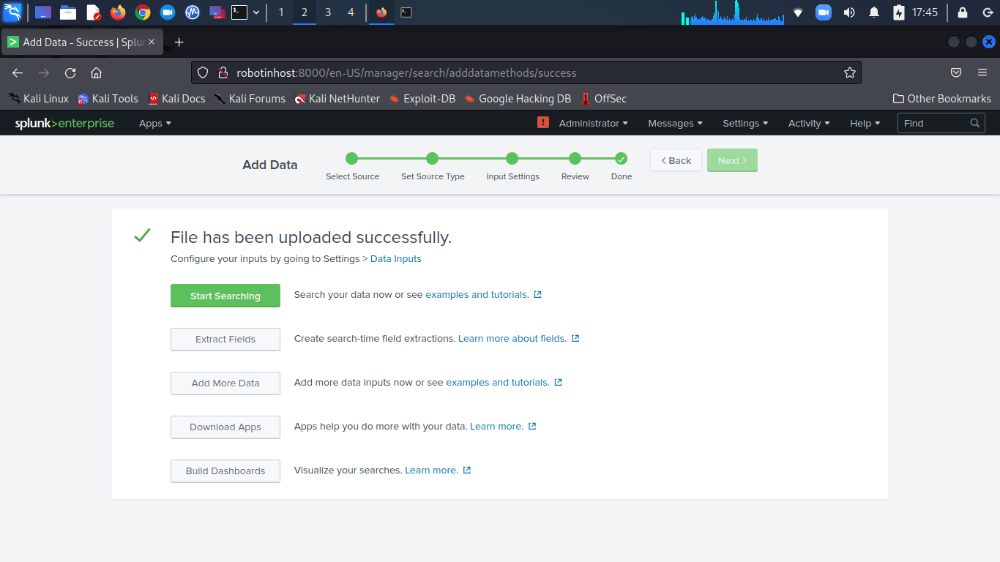
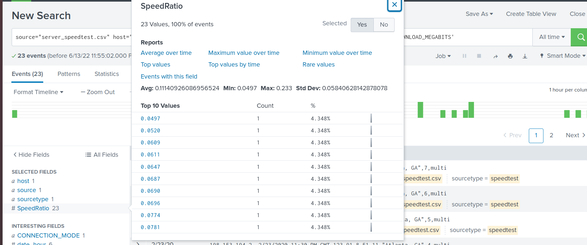
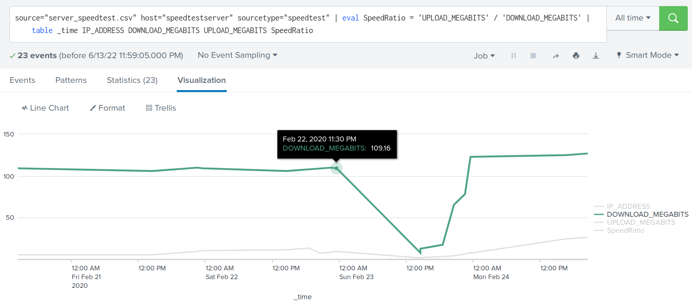
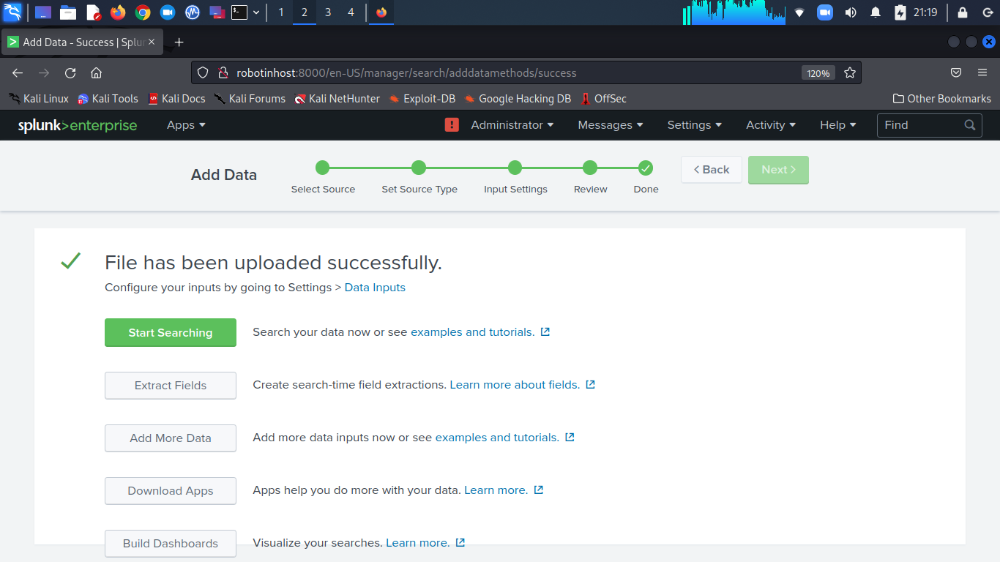
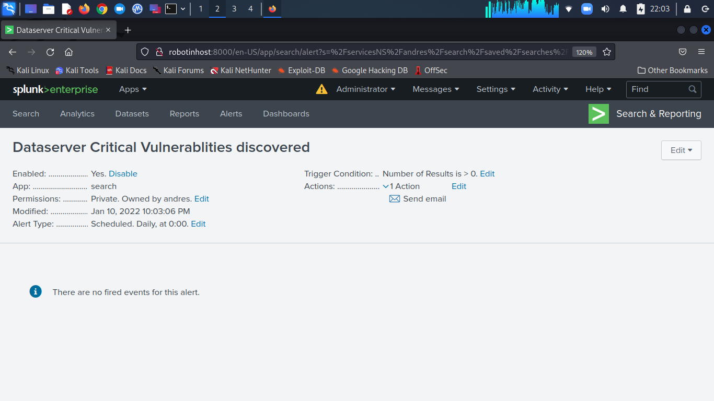
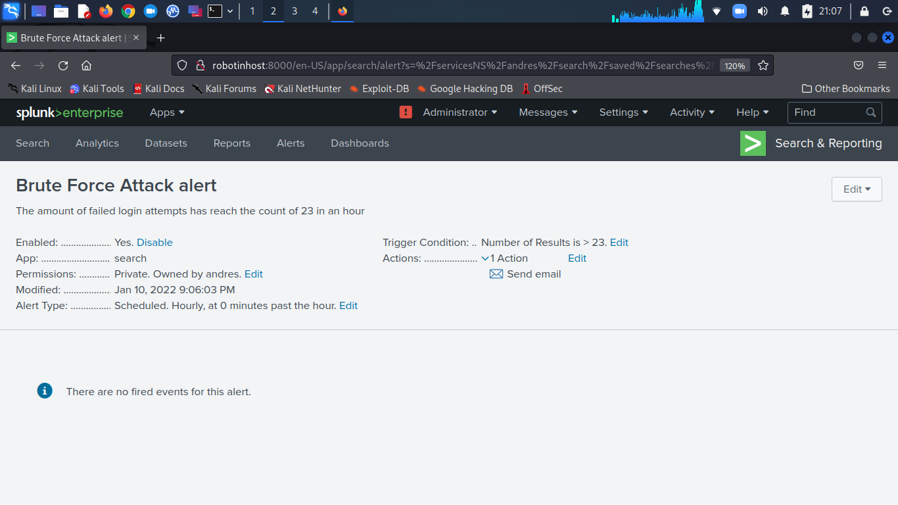

# Splunk: Analyzing Impact, vulnerability and drawing Baselines for alerts

- ### Task 1  Analyzing the Impact of the DDOS Attack
- ### Task 2 Are We Vulnerable?
- ### Task 3 Drawing the Baseline
 
 ***

# Let's go Splunking!

## Scenario 1

You have just been hired as an SOC Analyst by Vandalay Industries, an importing and exporting company.
- Vandalay Industries uses Splunk for their security monitoring and have been experiencing a variety of security issues against their online systems over the past few months.

- You are tasked with developing searches, custom reports and alerts to monitor Vandalay's security environment in order to protect them from future attacks.

## Objective

Utilize your Splunk skills to design a powerful monitoring solution to protect Vandaly from security attacks.

---

>## Task 1: Analyzing the Impact of the DDOS Attack

**Background:** As the worldwide leader of importing and exporting, Vandalay Industries has been the target of many adversaries attempting to disrupt their online business. Recently, Vandaly has been experiencing DDOS attacks against their web servers.

Not only were web servers taken offline by a DDOS attack, but upload and download speed were also significantly impacted after the outage. Your networking team provided results of a network speed run around the time of the latest DDOS attack.

**Task:** Create a report to determine the impact that the DDOS attack had on download and upload speed. Additionally, create an additional field to calculate the ratio of the upload speed to the download speed.

        Upload: Upload the file of the system speeds around the time of the attack.

        Create Field: Create a field called SpeedRatio showing the ratio between the upload and download speeds.

        Create Statistic Report: Create a table displaying the following fields:
            - Time
            - IP_ADDRESS
            - DOWNLOAD_MEGABITS
            - UPLOAD_MEGABITS
            - Ratio

        Use visualizations

        Conclusions:

### The attack began on February 22, 2020 at 11:30 pm. The lowest speed was reached on February 23, 2020 at 02:30 pm. The full recovery was restored on February 23 at 11:30 pm. the systems needed 24 hours to recover

---

>## Task 2: Are We Vulnerable?

**Background:** Due to the frequency of attacks, your manager needs to be sure that sensitive customer data on their servers is not vulnerable. Since Vandalay uses Nessus vulnerability scanners, you have pulled the last 24 hours of scans to see if there are any critical vulnerabilities.

**Task:** Create a report determining how many critical vulnerabilities exist on the customer data server. Then, build an alert to notify your team if a critical vulnerability reappears on this server.

        Upload: Upload the Nessus vulnerability scan.

        Vulnerabilities Count: Create a report that shows the count of critical vulnerabilities from the customer database server.

        Alert: Build an alert that monitors every day for critical vulnerabilities. Emailed alert to soc@vandalay.com

---

>## Task 3: Drawing the Baseline

**Background:** A Vandaly server is also experiencing brute force attacks into their administrator account. Management would like you to set up monitoring to notify the SOC team if a brute force attack occurs again.

**Task:** Analyze administrator logs that document a brute force attack. Then, create a baseline of the ordinary amount of administrator bad logins and determine a threshold to indicate if a brute force attack is occurring.

        Upload: Upload the administrator login logs.

        Conclusion: The brute force attack occurs On February 21 from 9:00 AM to 1:00 PM

        Baseline and Threshold: The average failed attempt is under 23 for an hour. The range 8 to 20 failed attempts for an hour. The baseline is 20 and the threshold will be set at 23.

    Alert: Create an alert to check the threshold every hour and email the SOC team at SOC@vandalay.com if triggered.  
